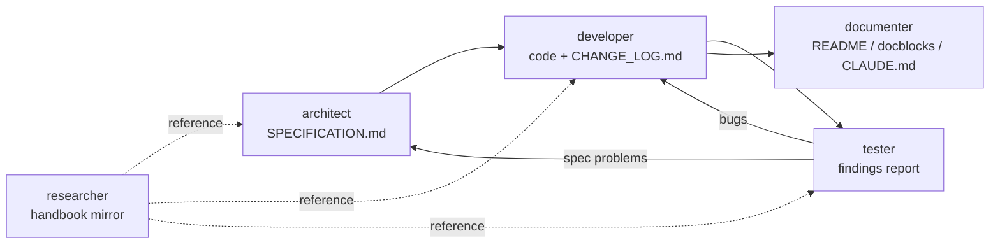

# Claude Code agents

Documentation for the project-level Claude Code subagents defined in [`.claude/agents/`](../../../.claude/agents/). Each agent has its own file here; this page is the overview.

These docs describe the agent definitions as they exist in the repo (snapshot: 2026-09-19). The `.claude/agents/*.md` files are the source of truth - when one changes, update its page here.

## Agents

| Agent | Role | Writes | Doc |
| --- | --- | --- | --- |
| `architect` | Designs a plugin and writes its specification | `SPECIFICATION.md` | [architect.md](architect.md) |
| `developer` | Implements/fixes plugin code against the spec; logs every change | Plugin code, `CHANGE_LOG.md` | [developer.md](developer.md) |
| `tester` | Verifies code against the spec's acceptance criteria and security conventions | Nothing by default | [tester.md](tester.md) |
| `documenter` | Keeps READMEs, spec accuracy, docblocks and `CLAUDE.md` in sync with the code | READMEs, docblocks, `CLAUDE.md`, spec corrections | [documenter.md](documenter.md) |
| `researcher` | General research with selectable modes: `wordpress-plugin-docs`, `wordpress-rest-api-docs`, `wordpress-wp-cli-command-docs`, `general` | The mode's mirror folder; nothing in `general` mode | [researcher.md](researcher.md) |

All five run on the `sonnet` model.

## How they fit together

The first four form a plugin lifecycle; the research agent is independent and supplies the reference material the others read.

Typical sequence for a new feature: `architect` updates the spec, `developer` implements it and adds a `CHANGE_LOG.md` entry, `tester` reviews it against the acceptance criteria, `documenter` brings the docs in line with what was actually built.

## Who owns what

| Artifact | Owner | Notes |
| --- | --- | --- |
| `src/<plugin>/SPECIFICATION.md` | `architect` | `documenter` corrects it when the built code has diverged; the spec describes the plugin as it currently is |
| `src/<plugin>/**/*.php`, JS/TS sources | `developer` | |
| `src/<plugin>/CHANGE_LOG.md` | `developer` | One entry per code change, including fixes and refactors |
| `src/<plugin>/README.md`, PHP docblocks | `documenter` | |
| Root `CLAUDE.md`, root `README.md` | `documenter` | |
| `docs/wordpress/**` mirrors | `researcher` (mirror modes) | Every other agent is told never to touch it |
| Verification reports | `tester` | Reported in the conversation, not committed |

These boundaries are enforced by each agent's instructions, not by tool permissions: `architect`, `tester` and `documenter` all have `Write`/`Edit` available.

## Shared behavior

- **Handbook mirror first.** For WordPress APIs and conventions, `architect`, `developer` and `tester` read the mirror under `docs/wordpress/wordpress-plugins/` rather than relying on memory; the `wordpress-handbook-lookup` skill maps a topic to its folder.
- **Microsoft Learn only for Microsoft integrations.** `architect`, `developer`, `tester` and `documenter` have the `microsoft-docs` MCP tools for plugins that integrate with Azure, Graph, Entra ID, .NET or Windows; they are not for ordinary WordPress questions. (`documenter` has search and fetch but not code-sample search.)
- **Flag, don't diverge.** If a request conflicts with the spec, `developer` flags it; if a criterion looks wrong, `tester` flags it for `architect`; if a doc is actively wrong, `documenter` says so explicitly.
- **Shared rules live in skills.** The security checklist, the Microsoft Learn guidance, the handbook topic map and the `CHANGE_LOG.md` procedure are skills in `.claude/skills/`, listed in each agent's `skills` frontmatter so the wording exists in one place. See [Skills](../skills/SKILLS.md).
- **No git actions.** None of the agents is instructed to commit or push; the research agent explicitly says it does not.

## How to invoke an agent

- **Automatically:** Claude delegates to an agent when the request matches its `description` (the trigger phrases are listed on each agent's page).
- **Explicitly:** name it in the request, for example "Use the tester agent to verify credentials-manager-plugin against its spec."
- **Slash commands:** `/sync-wordpress-plugin-docs`, `/sync-wordpress-rest-api-docs` and `/sync-wordpress-wp-cli-command-docs` (each with an optional scope) launch `researcher` in the matching mode (see [`.claude/commands/`](../../../.claude/commands/)).

A subagent starts with no memory of the conversation, so include the plugin slug and the specific task in the request.

## Configuration these agents depend on

| File | What it provides |
| --- | --- |
| [`.claude/agents/*.md`](../../../.claude/agents/) | The agent definitions: YAML frontmatter (`name`, `description`, `tools`, `model`) followed by the agent's instructions |
| [`.claude/commands/sync-wordpress-*.md`](../../../.claude/commands/) | The `/sync-wordpress-plugin-docs`, `/sync-wordpress-rest-api-docs` and `/sync-wordpress-wp-cli-command-docs` commands |
| `.claude/settings.json` | Enables the `microsoft-docs@claude-plugins-official` plugin (source of the `microsoft_docs_*` tools) |
| `.claude/settings.local.json` | Enables the project's `playwright` MCP server (`enabledMcpjsonServers`) |
| `.mcp.json` | Defines the headless `playwright` MCP server the research agent uses |

## Scope of this documentation

Only the five agents defined in this repository. Built-in agents (such as `Explore` or `general-purpose`) and agents supplied by installed plugins are not covered here.

## Related

- Root [`CLAUDE.md`](../../../CLAUDE.md) - repository conventions every agent is expected to follow
- [`docs/styles/`](../../styles/) - documentation style guides (`WORDPRESS-PLUGIN-DOCS-STYLE.md` governs the handbook mirror)
